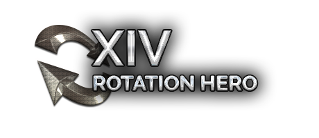

<a href="https://discord.gg/d7r8h5tDPA">
  
</a>


This is a free open source tool to practice your rotation inside and outside FFXIV.

To give this tool a try, head over to https://app.xivrotationhero.com/ to practice in the browser or use this URL as overlay in ACT to practice directly in game.

Note: The **full** browser version means opening the URL in the browser. This is completely free.

## Features

### Rotation hero overlay

* ACT Overlay Support (just include the URL)
* Community rotation presets for each discipile of war
* Customisable rotations with repeatable steps
* (Planned) Different training modes to increase efficiency in learning

### Full browser version

* Massive full version with simulated UI
* Hotbar customisation (1x12, 2x6, 3x4, 4x3, 6x2, 12x1, Scaling, Visibility)
* Drag/Drop of actions
* Persistent hotbar layout and allocation
* Persistent Key bindings
* Rotation Recorder / action history
* Combo indicators
* (Partial) Support for gamepads
* (Partial) Cross hotbars
* (Planned) Movement simulator for directionals and dodging practice
* (Evaluating) Drag/Drop of HOTBAR.DAT for automatic hotbar allocation

# Development

The primary development focuses on acting as ACT overlay. The browser version is mainly there to support players who for any reason 
can't run ACT and thus need to practice outside the game.

## Usage
Start developing in the **src/** directory. The structure will be preserved and all files and compilations are copied to the output directory **bin/**.

To start a local server and watch the *bin/* directory just call
```
npm run start
```

Alternatively, you can copy the `environment.local.ts.sample` to `environment.local.ts` and adjust it to your needs
and then run:
```
npm run start:local
```

# Disclaimer

This project is not sponsored or endorsed by SquareEnix.

Square Enix, Final Fantasy, Final Fantasy XIV, Final Fantasy XIV: Heavensward, Final Fantasy XIV: Stormblood, and all associated logos and designs are trademarks or registered trademarks of Square Enix Holdings Co., Ltd.

# License

This project is licensed under MIT.
